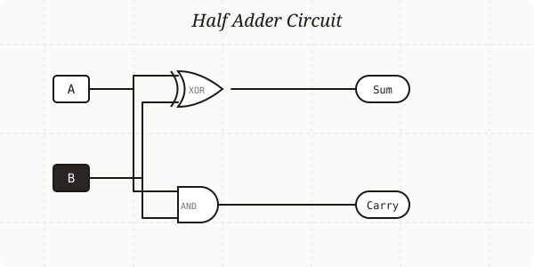

<div align="center">
  
</div>

# LogicSVG

LogicSVG is a declarative digital logic circuit simulator and visualizer. It allows users to define circuits using a simple, human-readable language and automatically generates interactive high-quality SVG diagrams and truth tables.

## Core Features

- **Declarative DSL**: Define circuits with a simple text-based format.
- **Real-time Simulation**: Toggle inputs in the diagram to see signals propagate through gates.
- **Automatic Layout**: Gates and wires are automatically positioned for optimal clarity.
- **Truth Table Generation**: Automatically calculate all possible input combinations and their results.
- **SVG Export**: Download your circuit diagrams as vector graphics for documentation or presentations.
- **Maximized View**: Focus on complex diagrams with a dedicated high-fidelity view mode.

## Quick Start

1. Define your inputs.
2. Connect them through logic gates.
3. Specify your outputs.

```text
# Example: Half Adder
INPUT A, B

Sum = XOR(A, B)
Carry = AND(A, B)

OUTPUT Sum
OUTPUT Carry
```

## Language Reference

### Inputs
Define external signals using the `INPUT` keyword followed by a comma-separated list of names.
```text
INPUT A, B, Cin
```

### Gates
Create logic gates by assigning a gate function to a unique identifier.
```text
XOR1 = XOR(A, B)
AND1 = AND(A, B)
```

**Supported Gate Types:**
- `AND`: High if all inputs are high.
- `OR`: High if at least one input is high.
- `NOT`: Inverts the input (single input only).
- `NAND`: Inverted AND.
- `NOR`: Inverted OR.
- `XOR`: Exclusive OR (high if an odd number of inputs are high).
- `XNOR`: Inverted XOR.

### Outputs
Define which signals are the final outputs of your circuit. You can optionally rename them.
```text
OUTPUT Result = XOR1
OUTPUT CarryOut = OR1
```

## Development

### Prerequisites
- Node.js (v18 or higher)
- npm or yarn

### Setup
```bash
# Install dependencies
npm install

# Run the development server
npm run dev
```

## Project Structure

- `/src/lib/parser.ts`: Tokenizer and AST parser for the circuit language.
- `/src/lib/circuit.ts`: Logic engine and simulation core.
- `/src/lib/layout.ts`: Layout algorithms for gates and wire routing.
- `/src/components/LogicSVG.tsx`: SVG rendering component.

## License
MIT
